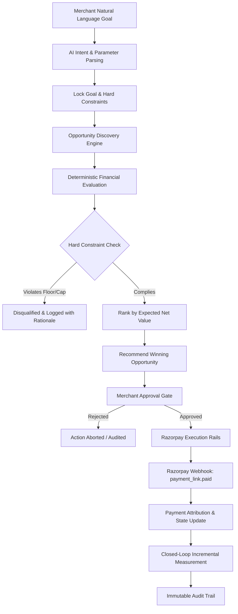

# Revenue Lift — AI Revenue Scientist for Razorpay Merchants

> **Autonomous revenue growth scientist that analyzes transaction signals, evaluates interventions with deterministic financial guardrails, enforces merchant approval governance, executes via Razorpay rails, and closes the loop with verifiable incremental measurement.**

---

## 1. Problem

Indian D2C and online merchants on Razorpay face continuous revenue leakage and growth challenges:
- **High Failed Checkout Rates:** Failed transactions, payment gateway timeouts, and abandoned checkouts lead to 15–30% lost gross merchandise value (GMV).
- **Suboptimal Margin Erosion:** Merchants launch aggressive flat-rate discounts that erode margins below operational viability.
- **Uncontrolled Automation Risk:** Traditional marketing automation tools blast customer segments without financial guardrails or human governance.
- **Lack of Verifiable Measurement:** Merchants cannot isolate true *incremental lift* from organic customer conversions or evaluate actual net retained profit vs. predicted value.

---

## 2. Solution

**Revenue Lift** acts as an autonomous AI Revenue Scientist embedded within the merchant's Razorpay ecosystem:
1. **Goal-Driven Intent Parsing:** Accepts natural language growth targets (e.g., *"Generate ₹50,000 extra revenue with at least 25% margin floor and max 10% discount"*).
2. **Dynamic Opportunity Discovery:** Scans customer cohorts, product catalog economics, and failed payment transactions.
3. **Deterministic Financial Decision Engine:** Ranks candidate interventions by **Expected Net Value (ENV)** with hard non-negotiable business constraint filters.
4. **Mandatory Human-in-the-Loop Governance:** Strictly prohibits consequential financial execution without explicit cryptographic merchant approval.
5. **Controlled Execution via Razorpay Rails:** Triggers test-mode or live-mode Razorpay Smart Payment Links with idempotency.
6. **Real-Time Webhook Reconciliation:** Ingests Razorpay webhooks (`payment_link.paid`, `payment.captured`, `payment.failed`) with HMAC-SHA256 signature verification.
7. **Closed-Loop Measurement & Audit:** Compares predicted vs. actual revenue and net retained value while maintaining an immutable event ledger.

---

## 3. Why Revenue Lift?

| Feature | Generic Marketing Tools | Pure LLM Agents | Revenue Lift (AI Revenue Scientist) |
| :--- | :--- | :--- | :--- |
| **Decision Logic** | Static IF-THEN rules | Stochastic, hallucinatory | **Deterministic Expected Net Value Formula** |
| **Financial Safety** | Manual oversight | Risky floating-point calculations | **Hard Constraints (Margin Floor, Discount Cap)** |
| **Execution Governance**| Automated or unmonitored | Uncontrolled tool calling | **Strict State Machine + Human Approval Gate** |
| **Gateway Integration** | Third-party webhooks | Absent | **Direct Native Razorpay Integration & Webhooks** |
| **Measurement** | Gross GMV reporting | Speculative | **Attributed Incremental Lift vs Control** |
| **Auditability** | Ephemeral logs | Inaccessible chat transcript | **Immutable Append-Only Audit Trail** |

---

## 4. Product Flow



---

## 5. System Architecture

```mermaid
graph TB
    subgraph Frontend["Merchant Dashboard (Next.js App Router)"]
        UI_Goal[Goal Input Panel]
        UI_Opps[Candidate Comparison Card]
        UI_Approve[Approval & Governance Card]
        UI_Exec[Execution & Gateway Status]
        UI_Meas[Measurement & Reconciliation Panel]
        UI_Audit[Immutable Audit Stream]
    end

    subgraph CoreEngine["Deterministic Core Engines"]
        GoalMgr[Goal Lifecycle Manager]
        DecisionEng[Deterministic Evaluator (Paise Math)]
        ConstraintFilter[Hard Constraint Enforcement]
        AuditLogger[Structured Audit Logger]
    end

    subgraph ExecutionLayer["Payment & Webhook Rails"]
        PaymentProv[Payment Provider Abstraction]
        DemoProv[DemoPaymentProvider]
        RzpProv[RazorpayPaymentProvider]
        WebhookHandler[HMAC-Verified Webhook Ingestion]
    end

    subgraph Storage["Data Store (Prisma ORM)"]
        DB[(PostgreSQL / SQLite dev.db)]
    end

    UI_Goal --> GoalMgr
    GoalMgr --> DB
    DecisionEng --> ConstraintFilter
    ConstraintFilter --> DB
    UI_Approve --> PaymentProv
    PaymentProv --> DemoProv
    PaymentProv --> RzpProv
    RzpProv --> WebhookHandler
    WebhookHandler --> DB
    DB --> UI_Audit
    DB --> UI_Meas
```

---

## 6. AI Responsibilities & Safe Boundaries

Revenue Lift enforces strict architectural separation between **probabilistic AI** and **deterministic financial decisioning**:

- **AI Responsibilities:**
  - Parsing natural language merchant intent (e.g. converting *"50k extra sales, margin >= 25%"* into structured JSON).
  - Synthesizing transparent natural-language tradeoff explanations grounded in the engine's exact numbers.
  - Suggesting hypothesis-driven opportunity descriptions.
- **AI Strict Boundaries (Non-Bypassable):**
  - AI **never** computes financial formulas or Expected Net Value.
  - AI **never** overrides or relaxes merchant hard constraints.
  - AI **cannot** approve an action.
  - AI **cannot** invoke execution rails directly.

---

## 7. Deterministic Decision Engine

All candidate ranking uses a mathematically verifiable formula:

$$\text{Expected Net Value (ENV)} = N \times P(\text{accept}) \times R_{\text{incremental}} - (N \times P(\text{accept}) \times C_{\text{incentive}})$$

Where:
- $N$ = Eligible customer count in target segment
- $P(\text{accept})$ = Calibrated acceptance probability
- $R_{\text{incremental}}$ = Expected incremental revenue per customer
- $C_{\text{incentive}}$ = Direct incentive and communication cost per customer

All calculations are performed with exact integer paise precision to eliminate floating-point rounding errors.

---

## 8. Hard Constraints Guardrails

Before any candidate can be considered for the winner recommendation, it must strictly satisfy all locked hard constraints:
1. **Margin Floor (`MARGIN_FLOOR`):** Projected gross margin after discounts must meet or exceed the merchant threshold (e.g. $\ge 25\%$).
2. **Discount Cap (`DISCOUNT_CAP`):** Incentive percentage cannot exceed the merchant limit (e.g. $\le 10\%$).
3. **Inventory Minimum (`INVENTORY_MIN`):** Campaign cannot deplete inventory below required buffer units (e.g. $\ge 15$ units).
4. **Duplicate Window (`DUPLICATE_WINDOW_DAYS`):** Re-engagement frequency guardrail prevents fatigue (e.g. $\ge 14$ days since last contact).

> **Crucial Rule:** Disqualified candidates **can never win**, even if their nominal expected revenue is higher than all other candidates.

---

## 9. Human Approval Governance

The lifecycle follows a strict formal state machine:

$$\text{DISCOVERED} \longrightarrow \text{EVALUATED} \longrightarrow \text{PENDING\_APPROVAL} \longrightarrow \text{APPROVED} \longrightarrow \text{INITIATED} \longrightarrow \text{COMPLETED / FAILED}$$

- Calling `/api/actions/execute` on an action that has not received explicit merchant approval (`status !== 'APPROVED'`) is strictly blocked with HTTP `403 Forbidden`.
- Duplicate approvals are handled idempotently.
- State jumps and unauthorized transitions throw structured domain errors (`IllegalStateTransitionError`).

---

## 10. Razorpay Integration

Revenue Lift implements a clean provider abstraction:
- **`DemoPaymentProvider`:** Fully deterministic, safe simulation for demos and automated testing. Allows failure simulation to test resilience.
- **`RazorpayPaymentProvider`:** Connects to Razorpay Test Mode or Live APIs using official credentials to generate real Payment Links (`plink_...`) with configured callback webhooks.

---

## 11. Webhook Architecture

Endpoint: `POST /api/webhooks/razorpay`

1. **HMAC SHA-256 Signature Verification:** Reads the `x-razorpay-signature` header and compares against `RAZORPAY_WEBHOOK_SECRET` using timing-safe buffer comparison.
2. **Idempotency Guarantee:** Deduplicates via the `WebhookEvent` table. Repeated delivery of the same event ID returns `200 OK` with `{ idempotent: true }` without re-crediting payments.
3. **Event Attribution:**
   - `payment_link.paid`, `payment.captured`, `order.paid`: Maps payment link ID or `notes.actionId` to CampaignAction, sets status to `COMPLETED`, records `Payment`, and emits audit events.
   - `payment.failed`: Records failure reason, marks action `FAILED` (if not completed), and preserves failure context.

---

## 12. Measurement & Outcome Reconciliation

Post-execution measurement distinguishes top-line GMV from net retained value:
- **Actual Incremental Revenue:** Measures gross realized sales towards target revenue.
- **Actual Net Value:** Deducts real incentive discounts and communication costs.
- **Prediction Accuracy:** Percentage accuracy of the deterministic model vs actual realized value.
- **Goal Attainment Rate:** Real-time percentage of merchant's revenue goal achieved.

---

## 13. Auditability

Every business-critical state change is permanently recorded in the `AuditEvent` ledger:
- `GOAL_CREATED` / `GOAL_CANCELLED`
- `ACTION_RECOMMENDED`
- `ACTION_APPROVED`
- `EXECUTION_INITIATED` / `EXECUTION_SUCCESS` / `EXECUTION_FAILED`
- `WEBHOOK_RECEIVED`
- `PAYMENT_CONFIRMED` / `PAYMENT_FAILED`
- `MEASUREMENT_RECORDED`

---

## 14. Tech Stack

- **Framework:** Next.js 16.3.4 (App Router) + React 19 + TypeScript
- **ORM & Database:** Prisma ORM 6.19 with SQLite (development/local) and PostgreSQL compatibility
- **Payment Gateway:** Razorpay SDK 2.9 + Native Webhooks
- **Styling:** Modern Tailwind CSS + Lucide Icons + Dark Glassmorphic Design System
- **Test Framework:** Vitest 5.0 with full unit and end-to-end integration coverage

---

## 15. Database Architecture

The schema comprises 13 structured models:
1. `Merchant`: Tenant profile with baseline margin and gateway settings
2. `Customer`: Segmented customer profiles (`DORMANT_HIGH_LTV`, `FAILED_CHECKOUT`, etc.)
3. `Product`: Catalog items with explicit cost price (COGS) and selling price
4. `Order`: Order header records
5. `OrderItem`: Line items with product economics
6. `Payment`: Transaction receipts linked to Razorpay payment IDs
7. `Goal`: Revenue targets and timeframe
8. `Constraint`: Locked hard business rules
9. `Opportunity`: Candidate and evaluated revenue opportunities
10. `CampaignAction`: Execution state machine record
11. `Execution`: Gateway execution records and provider references
12. `Measurement`: Verified post-action reconciliation metrics
13. `WebhookEvent`: Ingested webhook log for signature and idempotency tracking
14. `AuditEvent`: Append-only governance and security trail

---

## 16. API Endpoints

| Method | Path | Description | Governance / Auth |
| :--- | :--- | :--- | :--- |
| `POST` | `/api/agent` | Runs AI parser, locks goals, and evaluates opportunities | Merchant message required |
| `POST` | `/api/actions/approve` | Grants human merchant approval for candidate | Valid `actionId` required |
| `POST` | `/api/actions/execute` | Triggers Razorpay execution rails | **Strictly blocked without prior approval** |
| `POST` | `/api/measurements` | Reconciles captured payments and records lift | Execution must be `COMPLETED` |
| `POST` | `/api/webhooks/razorpay` | Receives Razorpay payment event webhooks | **HMAC SHA-256 signature required** |

---

## 17. Environment Variables

Create `.env` based on `.env.example`:

```bash
# Database Connection (SQLite dev or PostgreSQL production)
DATABASE_URL="file:./dev.db"

# Mode Flags
DEMO_MODE="true"
IS_SYNTHETIC_DATA="true"
DEMO_FORCE_EXECUTION_FAILURE="false"

# AI Provider (mock or gemini)
AI_PROVIDER="mock"
GEMINI_API_KEY=""

# Razorpay Test Credentials
RAZORPAY_KEY_ID="rzp_test_..."
RAZORPAY_KEY_SECRET="..."
RAZORPAY_WEBHOOK_SECRET="test_webhook_secret_key_12345"

# Application URL
NEXT_PUBLIC_APP_URL="http://localhost:3000"
```

---

## 18. Local Setup

```bash
# 1. Clone the repository
git clone https://github.com/your-username/revenue-lift.git
cd revenue-lift

# 2. Install dependencies
npm install

# 3. Setup database schema
npx prisma db push

# 4. Seed demo data (catalog, customer segments, failed checkouts, initial goal)
npm run seed

# 5. Start development server
npm run dev
```

Open [http://localhost:3000](http://localhost:3000) in your browser.

---

## 19. Demo Mode vs Live Mode

- **Demo Mode (`DEMO_MODE="true"`):** Generates simulated Razorpay batches without touching external networks. Fully deterministic, safe for stage demos and presentations.
- **Test Mode (`DEMO_MODE="false"` with `rzp_test_...` keys):** Creates real test-mode payment links on the Razorpay sandbox and listens for verified webhooks.

---

## 20. Running Tests & Quality Verification

Run the comprehensive test suite with Vitest:

```bash
# Run all tests
npm test

# Run typecheck
npx tsc --noEmit

# Run production build
npm run build
```

---

## 21. Known Limitations

- Multi-currency transactions currently default to `INR` (Razorpay's primary currency).
- SMS / WhatsApp messaging links are simulated via Razorpay payment link notifications in test mode.

---

## 22. Future Roadmap

- **Autonomous Multi-Armed Bandits (MAB):** Real-time Bayesian exploration/exploitation across discount percentages.
- **Predictive LTV Forecasting:** Neural survival models for dynamic repeat purchase prediction.
- **Automated WhatsApp Checkout Links:** Razorpay Payment Links dispatched via official WhatsApp Business API.
- **Multi-Tenant OAuth:** Razorpay Partner App OAuth onboarding for zero-touch merchant installation.
